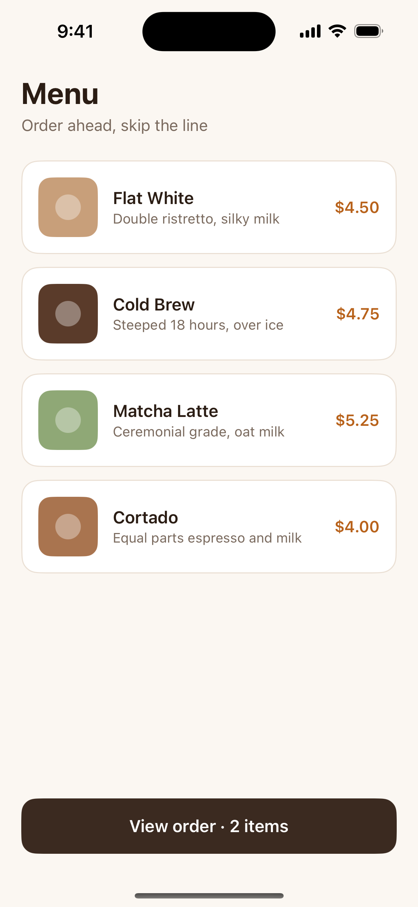
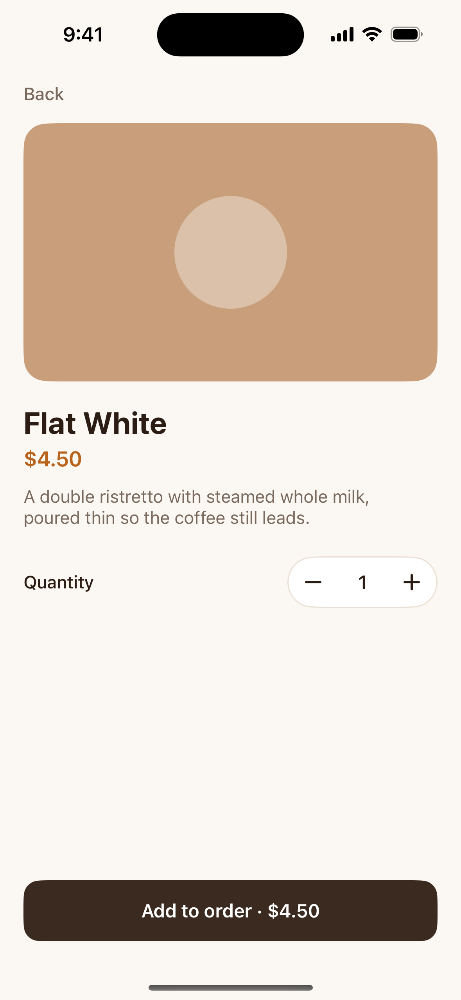
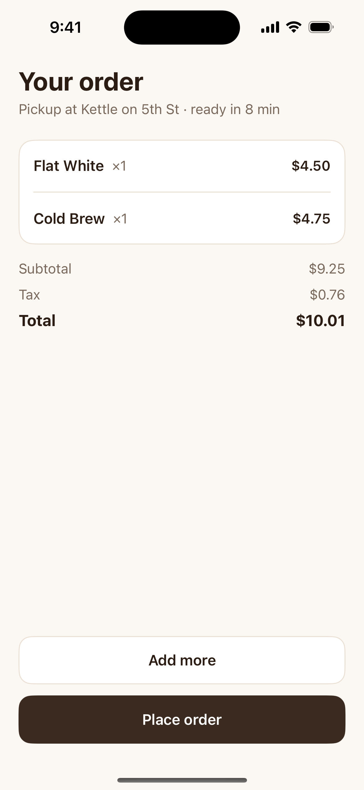
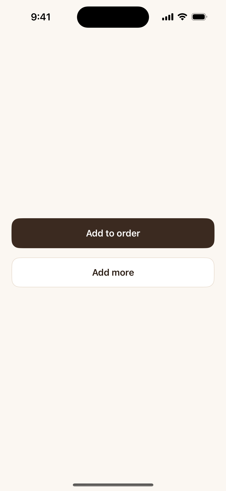
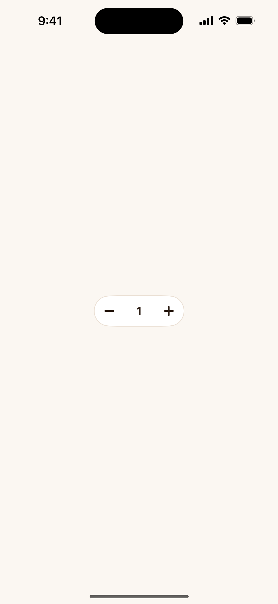

# scry-sample-ios

**Kettle**, a small SwiftUI coffee-order app, set up so [Scry](https://scrymore.com) can capture its screens.
Clone it, run it, send its screens to your own Scry project in five steps, then make it your own.

| Menu | Item Detail | Order | Button | QuantityStepper |
|---|---|---|---|---|
|  |  |  |  |  |

**No code of yours is uploaded.** Scry receives PNG screenshots and a small manifest (`scf.json`), nothing else.

The app is SwiftUI, iOS 17, Xcode 16.4 or newer, with no Swift packages, no network and no sign-in. It has three
screens (Menu, Item Detail, Order) and two components (Button, QuantityStepper), with the same copy and design
tokens as the Kettle React Native sample.

## Before you start

- A Mac with Xcode 16+ and an iOS simulator runtime (`xcrun simctl list devices available | grep "iPhone 16"`)
- Node 20+
- A Scry project and a project API key (Scry dashboard, Settings). Steps 1 to 3 need neither.

## 1. Clone and run

```sh
git clone https://github.com/scryorg/scry-sample-ios.git
cd scry-sample-ios
open Kettle.xcodeproj      # press Run on the "Kettle" scheme, iPhone 16
```

Or from the terminal: `xcodebuild test -project Kettle.xcodeproj -scheme Kettle -sdk iphonesimulator -destination "platform=iOS Simulator,name=iPhone 16"`.

## 2. Capture your screens

```sh
./scripts/capture.sh
```

It builds the app, boots the "iPhone 16" simulator with a clean status bar (9:41, full battery), opens each
registered screen by launch argument (`-ScryScreen <id>`), takes a screenshot of each, and writes
`.scry/capture/` (`scf.json` plus `images/*.png`). Expected output:

```
capture: menu ok
capture: item-detail ok
capture: order ok
capture: button ok
capture: quantity-stepper ok
scf: 5/5 captured, 0 skipped -> .scry/capture
```

Run it twice and the PNGs are byte-identical. It never uploads anything.

## 3. Check the bundle

```sh
npx @scrymore/scry-deployer upload .scry/capture --dry-run
```

Expected: `Bundle valid: 5 captures, source swiftui-preview:ios.` This validates and zips locally and sends nothing.

## 4. Upload

```sh
export SCRY_PROJECT_ID=proj_xxxxxxxx     # your project id
export SCRY_API_KEY=sk_live_xxxxxxxx     # your project API key; never commit it
npx @scrymore/scry-deployer upload .scry/capture
```

The values above are placeholders and will be rejected; use your own. Keep the key in your shell or in CI secrets,
never in a file in this repo (`.env*` is gitignored).

## 5. See it in Scry

Open your project in the Scry dashboard. The new build shows a **SwiftUI · iOS** chip on the Builds tab, with the
iPhone 16 device card and five screens. Open a screen to see it in the editor; it is also searchable and available to
the Scry MCP server.

## Put it in CI

`.github/workflows/ci.yml` builds and unit-tests on every pull request and push (hosted `macos-15` runner, no secrets).
`.github/workflows/scry-capture.yml` captures and uploads on a push to `main` only. To use it, set the repository
**variable** `SCRY_PROJECT_ID` and the repository **secret** `SCRY_API_KEY`. The capture workflow never runs on pull
requests, so a fork cannot read the key. `scripts/check-workflows.sh` fails if either rule is broken.

## Make it your own

Four things to change in this sample:

1. **Bundle id**: `PRODUCT_BUNDLE_IDENTIFIER` in `Kettle.xcodeproj` (currently `com.scryorg.kettle`).
2. **Screens**: add one entry per screen in `Kettle/ScryScreens.swift`: a stable `id`, a name, the file and line of the
   view, and the view built from fixed data. Never derive the id from a title a person may edit.
3. **Project id**: `SCRY_PROJECT_ID`.
4. **Key**: `SCRY_API_KEY`.

How the capture works, in the files you would copy into your own app:

| File | What it does |
|---|---|
| `Kettle/ScryLaunch.swift` | Reads `-ScryScreen <id>`, shows only that screen with no animation in light mode and default text size, prints `scry:ready <id>`. `-ScryList YES` prints the registry. A normal launch is unchanged. Compiled in Debug only (`#if DEBUG`); a Release build has none of it. |
| `Kettle/ScryScreens.swift` | The registry of ids, names, source file and line, and the view for each. |
| `Kettle/KettleApp.swift` | One wrapper: `ScryLaunchRoot { RootView() }`. |
| `Kettle/Fixtures.swift` | Fixed data, so every screen renders the same without network or sign-in. |
| `scripts/capture.sh` | Builds, boots the simulator, screenshots each screen, calls `make-scf.mjs`. |
| `scripts/make-scf.mjs` | Writes the SCF 1.0 bundle (`source.kind` `swiftui-preview`). |

The capture script is a reference script, not a built-in Scry adapter.

### Use the Scry skill

To set up your own existing app, let your AI assistant do it:

```sh
npx skills add scryorg/scry-node --skill scry-native-capture-setup
```

Then ask: "set up Scry capture for this app". The skill inspects your project, adds the launch hook, the screen
registry, fixtures and scripts (no new dependency), runs a capture and `upload --dry-run`, and shows you the screenshots.
It never uploads or touches your key without your go. To try it on an app with no Scry code, generate one from this repo:

```sh
./scripts/make-bare.sh ../kettle-bare     # the same app without any Scry hook; builds clean
```

## Troubleshooting

- **`no simulator named "iPhone 16" found`**: install an iOS runtime (Xcode > Settings > Components) or run
  `DEVICE="<name>" ./scripts/capture.sh` with a name from `xcrun simctl list devices available`.
- **`<id> never reported ready`**: the app did not start with the launch argument; the app output is printed with the message.
- **`capture produced 0 screens`**: nothing was captured; nothing is written.
- **`Missing X-API-Key` / `Project mismatch`** on upload: the key is unset, or belongs to another project.

## License

MIT, see [LICENSE](LICENSE).
